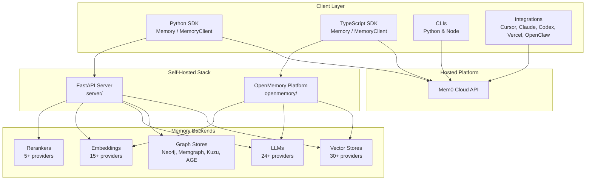
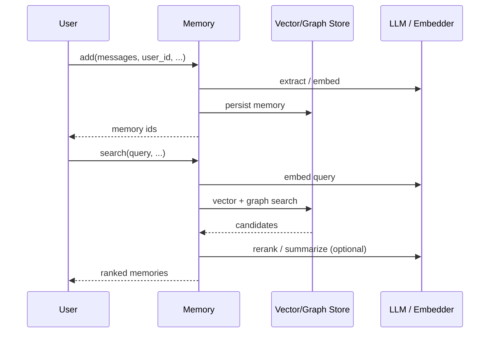
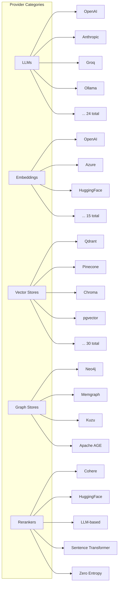
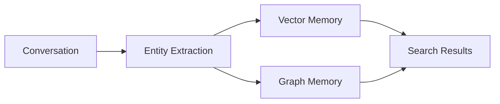
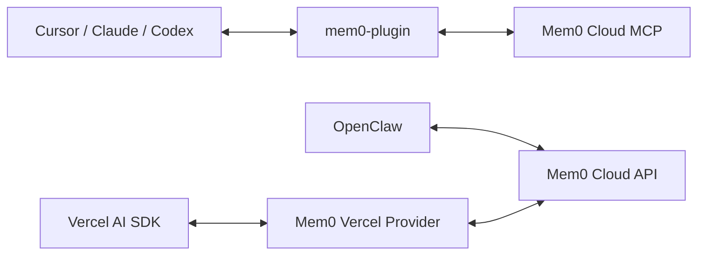
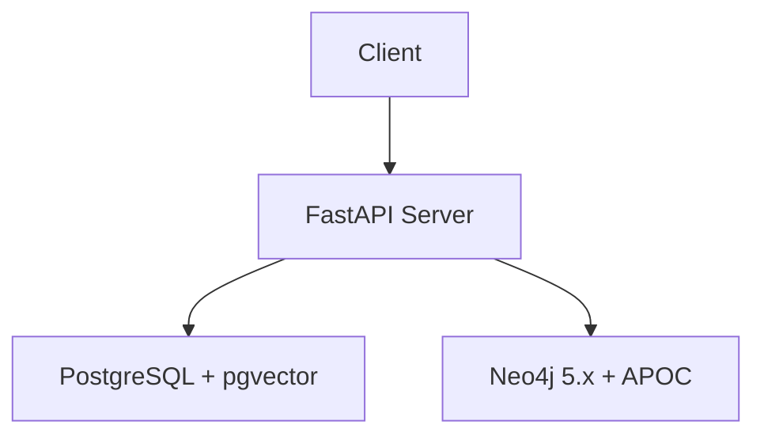
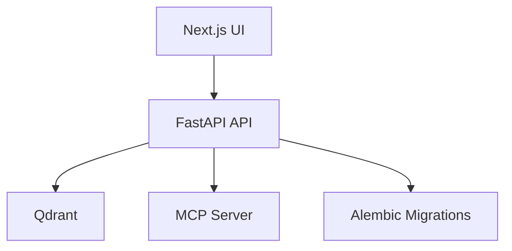
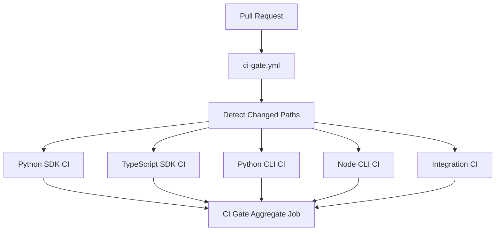
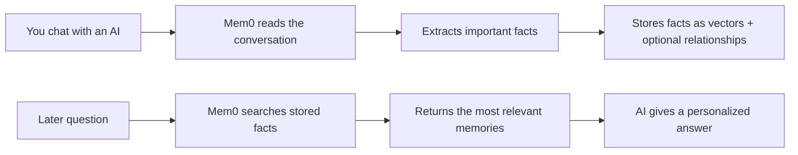

# Mem0 Architecture

This document describes the high-level architecture of the [Mem0](https://github.com/mem0ai/mem0) project, a polyglot monorepo providing persistent, personalized memory for AI agents and assistants through both a hosted platform and self-hosted open-source SDKs.

## Project Overview

Mem0 ("mem-zero") is an intelligent memory layer that lets agents and assistants remember context across conversations. It is distributed as:

- **Python SDK** (`mem0ai` on PyPI)
- **TypeScript SDK** (`mem0ai` on npm)
- **Command-line interfaces** (Python and Node)
- **Editor / agent integrations** (Cursor, Claude Code, Codex, Pi Agent, Vercel AI SDK, OpenClaw)
- **Self-hosted server stacks** (`server/` and `openmemory/`)

## Repository Layout

```
mem0/                          Core Python SDK
mem0-ts/                       TypeScript SDK
cli/python/                    Python CLI (mem0-cli)
cli/node/                      Node CLI (@mem0/cli)
integrations/                  Agent & editor integrations
  mem0-plugin/               AI editor plugins (Claude Code, Cursor, Codex)
  openclaw/                  OpenClaw plugin
  pi-agent-plugin/           Pi Agent plugin
  vercel-ai-sdk/             Vercel AI SDK provider
server/                        FastAPI self-hosted server
openmemory/                    Self-hosted memory platform (API + UI)
skills/                        Claude Code skill definitions
docs/                          Mintlify documentation
tests/                         Python SDK tests
evaluation/                    Benchmarking submodule
examples/                      Sample projects and demos
scripts/                       Repository-wide utilities
```

## High-Level Architecture



## Core SDK Architecture

### Python SDK (`mem0/`)

```
mem0/
├── memory/          Memory orchestration (add, search, get, update, delete, history)
├── llms/            LLM provider implementations (24+)
├── embeddings/      Embedding provider implementations (15+)
├── vector_stores/   Vector store provider implementations (30+)
├── graphs/          Graph store provider implementations (4)
├── reranker/        Reranker provider implementations (5)
└── configs/         Pydantic v2 configuration models
```

### TypeScript SDK (`mem0-ts/`)

```
mem0-ts/src/
├── client/          Hosted MemoryClient
├── oss/             Self-hosted Memory
├── llms/            LLM providers
├── embeddings/      Embedding providers
├── vector_stores/   Vector store providers
└── graphs/          Graph providers
```

## Two Usage Modes

| Mode | Python | TypeScript | Best For |
|------|--------|------------|----------|
| Self-hosted OSS | `Memory` / `AsyncMemory` | `Memory` from `mem0ai/oss` | Full control, on-premise deployments |
| Hosted Platform | `MemoryClient` / `AsyncMemoryClient` | `MemoryClient` from `mem0ai` | Managed infrastructure, fast setup |

Both modes expose the same core lifecycle:



## Sample Usage

The following examples show the most common ways to use Mem0 in Python. The TypeScript SDK follows the same patterns.

### 1. Hosted platform client

Use `MemoryClient` when you want Mem0 to manage the infrastructure. You only need an API key.

```python
from mem0 import MemoryClient

client = MemoryClient(api_key="your-mem0-api-key")

# Store a memory
result = client.add(
    messages="I prefer concise, bullet-point answers and I am allergic to peanuts.",
    user_id="alice",
    metadata={"source": "onboarding"},
)
print(result["memories"])  # list of stored memory ids

# Search relevant memories
memories = client.search(
    query="What should I avoid eating?",
    user_id="alice",
    limit=5,
)
for m in memories["memories"]:
    print(m["memory"], m["score"])

# Update a memory
client.update(memory_id="<id>", data="I am allergic to peanuts and tree nuts.")

# Delete all memories for a user
client.delete_all(user_id="alice")
```

### 2. Self-hosted memory with defaults

Use `Memory` when you want everything to run locally. The default configuration uses OpenAI for the LLM and embeddings, so an `OPENAI_API_KEY` is required unless you override those providers.

```python
from mem0 import Memory

memory = Memory()

memory.add(
    messages="I am working on a project called Phoenix and I prefer morning standups.",
    user_id="alice",
)

results = memory.search(
    query="Tell me about Alice's project preferences.",
    user_id="alice",
)
for r in results:
    print(r["memory"])
```

### 3. Self-hosted with local MiniLM (no API keys)

This setup runs entirely on your own machine using a free HuggingFace MiniLM model for embeddings and a MiniLM cross-encoder for reranking. You need to install `sentence-transformers` first.

```bash
pip install sentence-transformers
```

```python
from mem0 import Memory

config = {
    "llm": {
        "provider": "ollama",  # or another local LLM provider
        "config": {"model": "llama3.1"},
    },
    "embedder": {
        "provider": "huggingface",
        "config": {
            "model": "multi-qa-MiniLM-L6-cos-v1",
            "model_kwargs": {"device": "cpu"},
        },
    },
    "vector_store": {
        "provider": "qdrant",
        "config": {"embedding_model_dims": 384},
    },
    "reranker": {
        "provider": "sentence_transformer",
        "config": {
            "model": "cross-encoder/ms-marco-MiniLM-L-6-v2",
            "device": "cpu",
        },
    },
}

memory = Memory(config=config)

memory.add(
    messages="I like to review code in the afternoon, not the morning.",
    user_id="alice",
)

results = memory.search(
    query="When does Alice prefer to review code?",
    user_id="alice",
)
for r in results:
    print(r["memory"], r.get("rerank_score"))
```

### 4. Working with memory history

Mem0 keeps a version history for each memory, so you can see how a fact evolved over time.

```python
# Add a memory
add_result = memory.add(
    messages="My favorite color is blue.",
    user_id="alice",
)
memory_id = add_result[0]["id"]

# Update it later
memory.update(memory_id=memory_id, data="My favorite color is green.")

# View the change history
history = memory.history(memory_id=memory_id)
for entry in history:
    print(entry["created_at"], entry["memory"])
```

### 5. Common parameters

Most `add`, `search`, `get_all`, and `delete_all` calls accept these filters to scope memories:

| Parameter | Purpose |
|-----------|---------|
| `user_id` | Memories tied to a specific user |
| `agent_id` | Memories tied to a specific agent or app |
| `run_id` | Memories tied to a specific conversation session |
| `metadata` | Arbitrary key-value tags you can later filter on |

Use them together to build multi-tenant or multi-agent systems:

```python
memory.add(
    messages="Agent Beta should use formal tone.",
    agent_id="beta",
    metadata={"type": "persona"},
)

memory.search(
    query="What tone should Agent Beta use?",
    agent_id="beta",
    filters={"type": "persona"},
)
```

## Provider Pattern

Mem0 uses a consistent plugin architecture across five provider categories. Each category has a `base.py` abstract base class and concrete provider implementations.



### Adding a New Provider

1. Create `mem0/<category>/<provider_name>.py`
2. Inherit from `mem0/<category>/base.py`
3. Add configuration to `mem0/<category>/configs.py`
4. Register in `mem0/<category>/__init__.py`
5. Add tests in `tests/<category>/<provider_name>/`
6. Add optional dependencies to `pyproject.toml`

## MiniLM Support

Mem0 ships with out-of-the-box support for **MiniLM** models from the Hugging Face `sentence-transformers` ecosystem. MiniLM is used in two places: as a lightweight local embedding model and as a cross-encoder reranker. This makes it possible to run Mem0 entirely on local CPU/GPU hardware without external API keys.

### MiniLM as an Embedding Model

The `huggingface` embedder provider uses `sentence-transformers` under the hood. When no model is specified, it defaults to `multi-qa-MiniLM-L6-cos-v1`.

```python
from mem0 import Memory

config = {
    "embedder": {
        "provider": "huggingface",
        "config": {
            "model": "multi-qa-MiniLM-L6-cos-v1",
            "model_kwargs": {"device": "cpu"},  # or "cuda"
        },
    },
    "vector_store": {
        "provider": "qdrant",  # or any other supported vector store
        "config": {"embedding_model_dims": 384},
    },
}

memory = Memory(config=config)
```

Key configuration fields:

| Field | Type | Description |
|-------|------|-------------|
| `provider` | `str` | Must be `"huggingface"` |
| `config.model` | `str` | HuggingFace `sentence-transformers` model name, e.g. `multi-qa-MiniLM-L6-cos-v1`, `all-MiniLM-L6-v2`, `paraphrase-MiniLM-L6-v2` |
| `config.model_kwargs` | `dict` | Arguments passed to `SentenceTransformer(...)`, such as `device`, `trust_remote_code`, etc. |
| `config.embedding_dims` | `int` | Optional; auto-detected from the model if omitted. MiniLM-L6 models emit 384 dimensions. |
| `config.huggingface_base_url` | `str` | Optional; if set, the provider switches to an OpenAI-compatible Text Embeddings Inference (TEI) server instead of loading the model locally. |

### MiniLM as a Reranker

The `sentence_transformer` reranker provider uses a cross-encoder MiniLM model to rescore candidates retrieved from vector search. The default model is `cross-encoder/ms-marco-MiniLM-L-6-v2`.

```python
from mem0 import Memory

config = {
    "embedder": {
        "provider": "huggingface",
        "config": {"model": "multi-qa-MiniLM-L6-cos-v1"},
    },
    "reranker": {
        "provider": "sentence_transformer",
        "config": {
            "model": "cross-encoder/ms-marco-MiniLM-L-6-v2",
            "device": "cpu",
            "batch_size": 32,
            "show_progress_bar": False,
        },
    },
}

memory = Memory(config=config)
```

Reranker-specific fields:

| Field | Type | Default | Description |
|-------|------|---------|-------------|
| `provider` | `str` | `"cohere"` | Must be `"sentence_transformer"` to use the local MiniLM cross-encoder |
| `config.model` | `str` | `"cross-encoder/ms-marco-MiniLM-L-6-v2"` | HuggingFace cross-encoder model name |
| `config.device` | `str` | `None` | Device to run on (`"cpu"`, `"cuda"`, etc.). `None` auto-detects. |
| `config.batch_size` | `int` | `32` | Batch size for scoring query-document pairs |
| `config.show_progress_bar` | `bool` | `False` | Whether to show a progress bar during reranking |
| `config.top_k` | `int` | `None` | Number of top documents to return after reranking |

### Requirements

For either MiniLM use case, install the `sentence-transformers` dependency (included in the HuggingFace optional dependency group):

```bash
pip install sentence-transformers
# or, when installing mem0ai with extras:
pip install "mem0ai[huggingface]"
```

### Why MiniLM?

- **Small footprint**: L6 variants are roughly 80 MB and run comfortably on CPU.
- **No API keys**: Works entirely offline after the model is downloaded.
- **Fast inference**: Suitable for local prototypes and low-latency self-hosted deployments.
- **Well-known defaults**: The default choices (`multi-qa-MiniLM-L6-cos-v1` for embeddings, `ms-marco-MiniLM-L-6-v2` for reranking) are optimized for semantic search and passage ranking.

## Graph Memory

Graph memory is an optional layer on top of vector memory that enables relationship-aware retrieval. It is configured through the `graph` section of `MemoryConfig` and can extract entities and relationships from conversations to improve recall.



## MCP Integration

Mem0 exposes memory operations through the Model Context Protocol (MCP) in three forms:

| Location | Purpose |
|----------|---------|
| `mcp.mem0.ai` | Remote MCP server |
| `openmemory/api/` | Local FastAPI MCP server |
| `integrations/mem0-plugin/` | Editor plugin MCP tools |

The plugin exposes nine MCP tools: `add_memory`, `search_memories`, `get_memories`, `get_memory`, `update_memory`, `delete_memory`, `delete_all_memories`, `delete_entities`, and `list_entities`.

## Plugin & Skills System

### Integrations (`integrations/`)

Each integration is a self-contained package with its own `package.json`, build, and tests. They connect agents and editors to the hosted Mem0 API.



### Skills (`skills/`)

Skills are structured knowledge and workflows for Claude Code:

- **Reference skills** (always-on): `mem0/`, `mem0-cli/`, `mem0-vercel-ai-sdk/`
- **Pipeline skills** (on-demand):
  - `mem0-integrate/`: wire Mem0 into an existing repo via a TDD pipeline
  - `mem0-test-integration/`: verify integration artifacts
  - `mem0-oss-to-platform/`: migrate from OSS to hosted platform SDK

## Server & Deployment Architectures

### `server/` (FastAPI + PostgreSQL + Neo4j)



### `openmemory/` (FastAPI + Qdrant + Next.js)



## CI/CD Architecture

### CI Gate (`ci-gate.yml`)

All pull requests go through a single CI Gate that detects changed packages and invokes only the relevant package workflows via `workflow_call`.



### Release Router (`release.yml`)

Releases are routed by tag prefix to the correct package CD workflow.

| Tag Prefix | Package | Registry |
|------------|---------|----------|
| `v*` | Python SDK | PyPI (`mem0ai`) |
| `ts-v*` | TypeScript SDK | npm (`mem0ai`) |
| `cli-v*` | Python CLI | PyPI (`mem0-cli`) |
| `cli-node-v*` | Node CLI | npm (`@mem0/cli`) |
| `vercel-ai-v*` | Vercel AI SDK | npm (`@mem0/vercel-ai-provider`) |
| `openclaw-v*` | OpenClaw | npm (`@mem0/openclaw-mem0`) |
| `opencode-v*` | OpenCode Plugin | npm (`@mem0/opencode-plugin`) |
| `pi-agent-v*` | Pi Agent Plugin | npm (`@mem0/pi-agent-plugin`) |

All publishing uses OIDC trusted publishing, so no registry tokens or secrets are stored in the repository.

## Technology Matrix

| Concern | Python SDK | TypeScript SDK | Python CLI | Node CLI | Server | OpenMemory |
|---------|------------|----------------|------------|----------|--------|------------|
| Language | Python 3.9+ | Node 20/22 | Python 3.10+ | Node 18+ | Python | TypeScript / Python |
| Build | hatch | tsup | hatch | tsup | Docker | Docker / Next.js |
| Lint | ruff (120) | prettier | ruff (100) | biome | — | — |
| Test | pytest | jest | pytest | vitest | — | pytest |
| Package manager | — | pnpm | — | pnpm | — | npm / pnpm |

## Data Flow Summary

1. **Ingestion**: Messages flow into `Memory.add()` or `MemoryClient.add()`.
2. **Extraction**: LLMs extract facts, entities, and relationships.
3. **Embedding**: Embedding models convert text into vector representations.
4. **Storage**: Vectors are stored in a configured vector store; optional graph triples go to a graph store.
5. **Retrieval**: `search()` embeds the query, performs vector and graph retrieval, optionally reranks, and returns ranked memories.
6. **Evolution**: Memories can be updated, deleted, and versioned via `history()`.

## See Also

- `AGENTS.md` — complete contributor and development guide
- `docs/` — public documentation site
- `server/docker-compose.yml` — local self-hosted development stack
- `openmemory/docker-compose.yml` — local OpenMemory development stack

## Layman's Guide: What Mem0 Does

This section explains the ideas above in plain language for anyone who is not a software engineer.

### What is Mem0, in one sentence?

Mem0 is a "memory bank" that lets AI assistants remember facts about you across many conversations, so the assistant feels more personal and consistent each time you talk to it.

### Think of it like a smart notebook

Imagine you are chatting with a helpful assistant. Over time you mention things like:

- "I am allergic to peanuts."
- "I prefer short, bullet-point answers."
- "I am working on a project called Phoenix."

Mem0 writes those facts into a notebook, connects related facts, and later reminds the assistant of them when they are relevant. The assistant does not have to remember everything itself.

### Hosted vs. self-hosted

| Option | Simple analogy | Who runs it? |
|--------|---------------|--------------|
| **Hosted** | A bank safety deposit box managed by the bank | Mem0 runs the servers; you just use the API |
| **Self-hosted** | A safe in your own house | You run the software on your own computer or servers |

Hosted is easier to start with. Self-hosted gives you more privacy and control because your data stays on your machines.

### What is an embedding?

An embedding turns a sentence into a list of numbers that captures its meaning. Two sentences with similar meanings get similar numbers. This lets Mem0 find memories by meaning instead of just matching exact words.

Think of it as translating every sentence into a point on a map; sentences that mean similar things end up close together.

### What is a vector store?

A vector store is the database that keeps all those number-lists. When you ask a question, Mem0 quickly searches that database for the closest matching memories.

### What is graph memory?

Graph memory is an extra layer that remembers *relationships* between facts, such as:

- "Alice works at Acme Corp."
- "Acme Corp is based in London."

If you later ask, "Where does Alice work?" or "Which companies are in London?", the graph helps Mem0 answer by following those connections.

### What is an LLM?

LLM stands for "Large Language Model." It is the AI that understands and writes human language. Mem0 uses an LLM to:

- Pull out important facts from your messages.
- Decide how to update old memories.
- Summarize or explain stored information when needed.

### What is a reranker?

When Mem0 searches the vector store, it may get many candidate memories. A reranker is a second model that scores those candidates to put the most useful ones at the top.

Analogy: the vector store finds a shelf of possibly relevant books; the reranker picks the best ones for your specific question.

### What is MiniLM?

MiniLM is a small, free, open-source family of language models. Mem0 can use MiniLM for both embeddings and reranking. It is popular because it is:

- **Tiny**: about 80 MB, smaller than most videos on your phone.
- **Free**: no API key or subscription needed.
- **Private**: runs entirely on your computer.
- **Fast enough**: works well for prototypes and small-to-medium projects.

### What is MCP?

MCP (Model Context Protocol) is a standard way for AI editors and agents to talk to Mem0. It is like a universal USB-C port for memory: once an editor supports MCP, it can use Mem0 without custom code.

### What is CI/CD?

CI/CD is the robot helper that checks and ships code automatically. When a developer opens a change, CI runs tests and linting. When a release is tagged, CD publishes the updated package to PyPI or npm.

### What is a provider?

A provider is a swappable plugin. Mem0 has providers for LLMs, embeddings, vector stores, graph stores, and rerankers. This means you can mix and match: for example, use OpenAI for the LLM, MiniLM for embeddings, and Qdrant for the vector store, all in one project.

### The big picture



In short, Mem0 turns scattered conversations into a reusable, searchable memory that makes AI assistants feel more helpful and personal.
