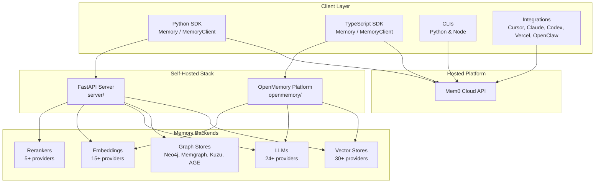
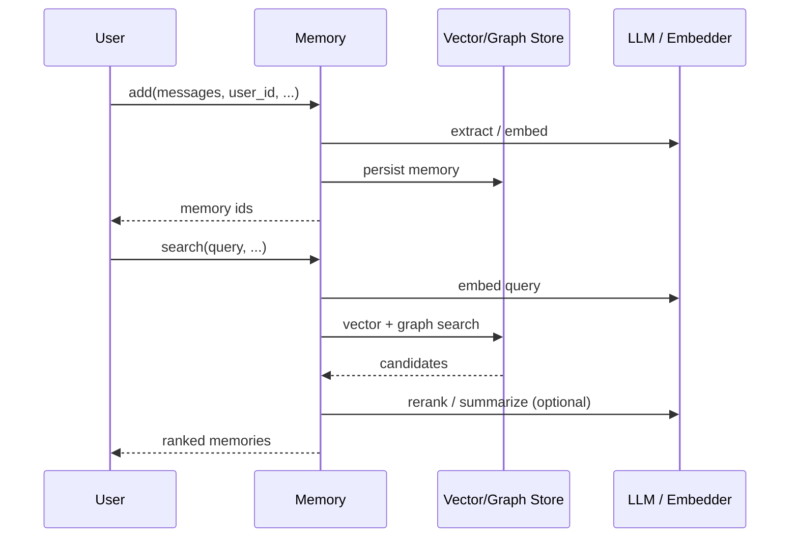
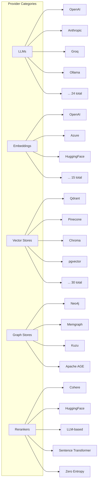
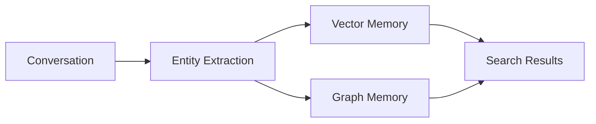
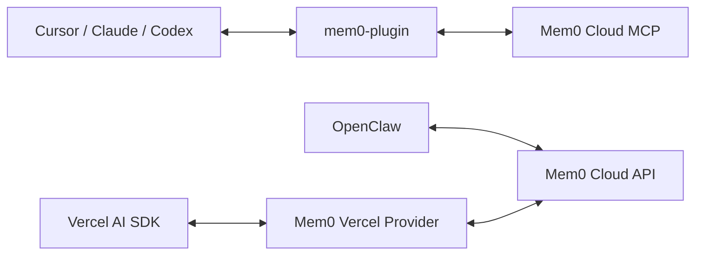
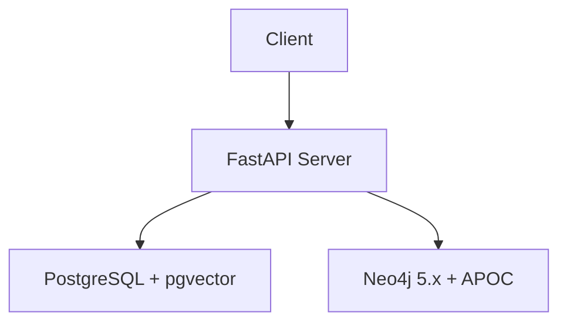
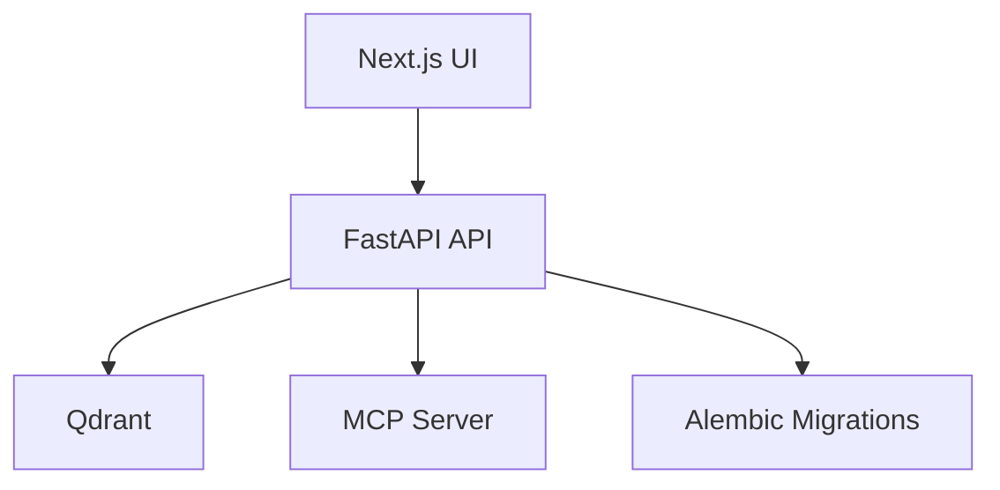
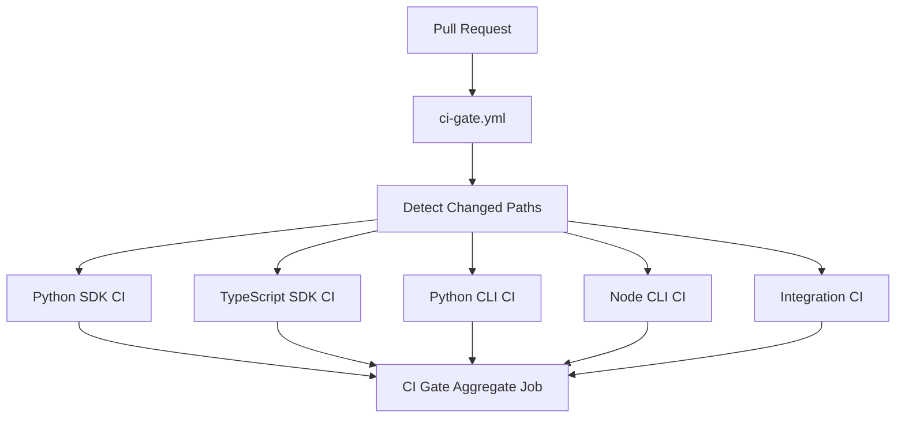

# Mem0 Architecture

This document describes the high-level architecture of the [Mem0](https://github.com/mem0ai/mem0) project, a polyglot monorepo providing persistent, personalized memory for AI agents and assistants through both a hosted platform and self-hosted open-source SDKs.

## Project Overview

Mem0 ("mem-zero") is an intelligent memory layer that lets agents and assistants remember context across conversations. It is distributed as:

- **Python SDK** (`mem0ai` on PyPI)
- **TypeScript SDK** (`mem0ai` on npm)
- **Command-line interfaces** (Python and Node)
- **Editor / agent integrations** (Cursor, Claude Code, Codex, Pi Agent, Vercel AI SDK, OpenClaw)
- **Self-hosted server stacks** (`server/` and `openmemory/`)

## Repository Layout

```
mem0/                          Core Python SDK
mem0-ts/                       TypeScript SDK
cli/python/                    Python CLI (mem0-cli)
cli/node/                      Node CLI (@mem0/cli)
integrations/                  Agent & editor integrations
  mem0-plugin/               AI editor plugins (Claude Code, Cursor, Codex)
  openclaw/                  OpenClaw plugin
  pi-agent-plugin/           Pi Agent plugin
  vercel-ai-sdk/             Vercel AI SDK provider
server/                        FastAPI self-hosted server
openmemory/                    Self-hosted memory platform (API + UI)
skills/                        Claude Code skill definitions
docs/                          Mintlify documentation
tests/                         Python SDK tests
evaluation/                    Benchmarking submodule
examples/                      Sample projects and demos
scripts/                       Repository-wide utilities
```

## High-Level Architecture



## Core SDK Architecture

### Python SDK (`mem0/`)

```
mem0/
├── memory/          Memory orchestration (add, search, get, update, delete, history)
├── llms/            LLM provider implementations (24+)
├── embeddings/      Embedding provider implementations (15+)
├── vector_stores/   Vector store provider implementations (30+)
├── graphs/          Graph store provider implementations (4)
├── reranker/        Reranker provider implementations (5)
└── configs/         Pydantic v2 configuration models
```

### TypeScript SDK (`mem0-ts/`)

```
mem0-ts/src/
├── client/          Hosted MemoryClient
├── oss/             Self-hosted Memory
├── llms/            LLM providers
├── embeddings/      Embedding providers
├── vector_stores/   Vector store providers
└── graphs/          Graph providers
```

## Two Usage Modes

| Mode | Python | TypeScript | Best For |
|------|--------|------------|----------|
| Self-hosted OSS | `Memory` / `AsyncMemory` | `Memory` from `mem0ai/oss` | Full control, on-premise deployments |
| Hosted Platform | `MemoryClient` / `AsyncMemoryClient` | `MemoryClient` from `mem0ai` | Managed infrastructure, fast setup |

Both modes expose the same core lifecycle:



## Provider Pattern

Mem0 uses a consistent plugin architecture across five provider categories. Each category has a `base.py` abstract base class and concrete provider implementations.



### Adding a New Provider

1. Create `mem0/<category>/<provider_name>.py`
2. Inherit from `mem0/<category>/base.py`
3. Add configuration to `mem0/<category>/configs.py`
4. Register in `mem0/<category>/__init__.py`
5. Add tests in `tests/<category>/<provider_name>/`
6. Add optional dependencies to `pyproject.toml`

## Graph Memory

Graph memory is an optional layer on top of vector memory that enables relationship-aware retrieval. It is configured through the `graph` section of `MemoryConfig` and can extract entities and relationships from conversations to improve recall.



## MCP Integration

Mem0 exposes memory operations through the Model Context Protocol (MCP) in three forms:

| Location | Purpose |
|----------|---------|
| `mcp.mem0.ai` | Remote MCP server |
| `openmemory/api/` | Local FastAPI MCP server |
| `integrations/mem0-plugin/` | Editor plugin MCP tools |

The plugin exposes nine MCP tools: `add_memory`, `search_memories`, `get_memories`, `get_memory`, `update_memory`, `delete_memory`, `delete_all_memories`, `delete_entities`, and `list_entities`.

## Plugin & Skills System

### Integrations (`integrations/`)

Each integration is a self-contained package with its own `package.json`, build, and tests. They connect agents and editors to the hosted Mem0 API.



### Skills (`skills/`)

Skills are structured knowledge and workflows for Claude Code:

- **Reference skills** (always-on): `mem0/`, `mem0-cli/`, `mem0-vercel-ai-sdk/`
- **Pipeline skills** (on-demand):
  - `mem0-integrate/`: wire Mem0 into an existing repo via a TDD pipeline
  - `mem0-test-integration/`: verify integration artifacts
  - `mem0-oss-to-platform/`: migrate from OSS to hosted platform SDK

## Server & Deployment Architectures

### `server/` (FastAPI + PostgreSQL + Neo4j)



### `openmemory/` (FastAPI + Qdrant + Next.js)



## CI/CD Architecture

### CI Gate (`ci-gate.yml`)

All pull requests go through a single CI Gate that detects changed packages and invokes only the relevant package workflows via `workflow_call`.



### Release Router (`release.yml`)

Releases are routed by tag prefix to the correct package CD workflow.

| Tag Prefix | Package | Registry |
|------------|---------|----------|
| `v*` | Python SDK | PyPI (`mem0ai`) |
| `ts-v*` | TypeScript SDK | npm (`mem0ai`) |
| `cli-v*` | Python CLI | PyPI (`mem0-cli`) |
| `cli-node-v*` | Node CLI | npm (`@mem0/cli`) |
| `vercel-ai-v*` | Vercel AI SDK | npm (`@mem0/vercel-ai-provider`) |
| `openclaw-v*` | OpenClaw | npm (`@mem0/openclaw-mem0`) |
| `opencode-v*` | OpenCode Plugin | npm (`@mem0/opencode-plugin`) |
| `pi-agent-v*` | Pi Agent Plugin | npm (`@mem0/pi-agent-plugin`) |

All publishing uses OIDC trusted publishing, so no registry tokens or secrets are stored in the repository.

## Technology Matrix

| Concern | Python SDK | TypeScript SDK | Python CLI | Node CLI | Server | OpenMemory |
|---------|------------|----------------|------------|----------|--------|------------|
| Language | Python 3.9+ | Node 20/22 | Python 3.10+ | Node 18+ | Python | TypeScript / Python |
| Build | hatch | tsup | hatch | tsup | Docker | Docker / Next.js |
| Lint | ruff (120) | prettier | ruff (100) | biome | — | — |
| Test | pytest | jest | pytest | vitest | — | pytest |
| Package manager | — | pnpm | — | pnpm | — | npm / pnpm |

## Data Flow Summary

1. **Ingestion**: Messages flow into `Memory.add()` or `MemoryClient.add()`.
2. **Extraction**: LLMs extract facts, entities, and relationships.
3. **Embedding**: Embedding models convert text into vector representations.
4. **Storage**: Vectors are stored in a configured vector store; optional graph triples go to a graph store.
5. **Retrieval**: `search()` embeds the query, performs vector and graph retrieval, optionally reranks, and returns ranked memories.
6. **Evolution**: Memories can be updated, deleted, and versioned via `history()`.

## See Also

- `AGENTS.md` — complete contributor and development guide
- `docs/` — public documentation site
- `server/docker-compose.yml` — local self-hosted development stack
- `openmemory/docker-compose.yml` — local OpenMemory development stack
